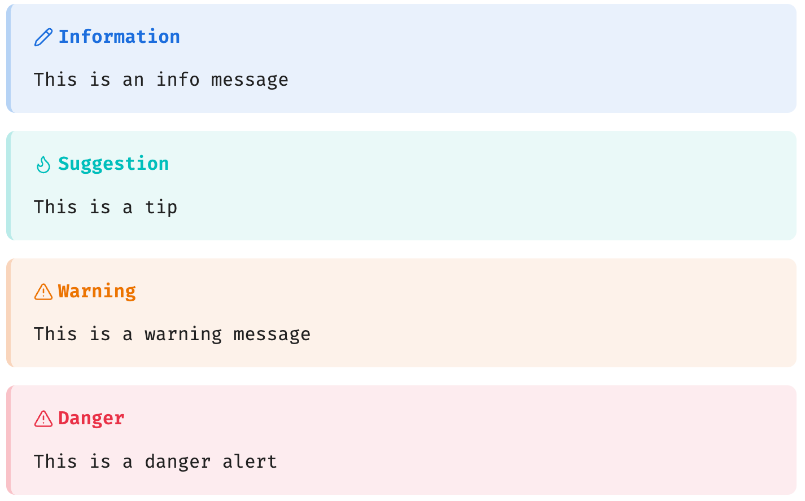
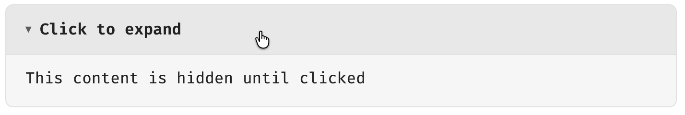
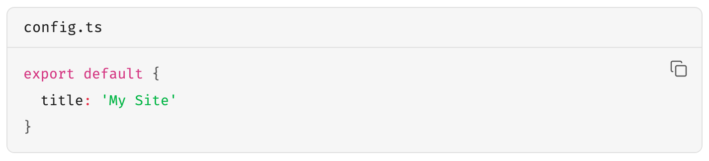
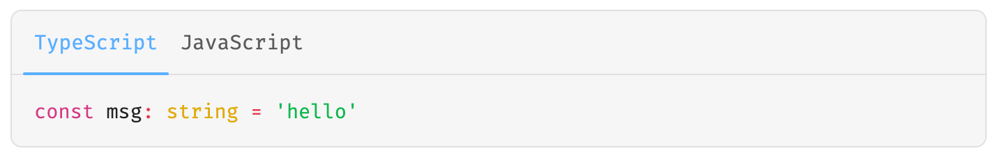
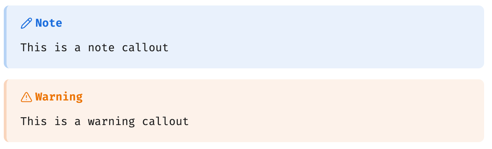
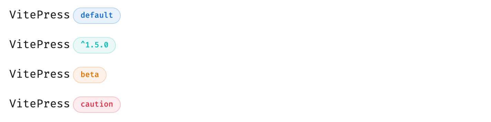

# VitePress Theme for Obsidian

A [VitePress](https://vitepress.dev/)-style theme plugin for Obsidian, bringing the modern documentation aesthetic and syntax to your notes.

**[中文文档](./README.zh.md)**

## Features

### Alert Containers

Renders VitePress native `:::` syntax as GitHub Alert-style cards with optional custom titles:

```markdown
::: info Information
This is an info message
:::

::: tip Suggestion
This is a tip
:::

::: warning Warning
This is a warning message
:::

::: danger Danger
This is a danger alert
:::
```



### Collapsible Container

Renders `::: details` as a native clickable `<details>/<summary>` element:

```markdown
::: details Click to expand
This content is hidden until clicked
:::
```



### Enhanced Code Blocks

Code blocks automatically get a language label and filename display, supporting VitePress `[filename]` syntax:

````markdown
```ts [config.ts]
export default {
  title: 'My Site'
}
```
````



### Code Groups

Groups multiple consecutive code blocks into a tabbed switcher:

````markdown
::: code-group

```ts [TypeScript]
const msg: string = 'hello'
```

```js [JavaScript]
const msg = 'hello'
```

:::
````



### Obsidian Callout Adaptation

Native Obsidian Callouts are automatically styled to match VitePress colors:

```markdown
> [!note]
> This is a note callout

> [!warning]
> This is a warning callout
```



### Badge Component

VitePress-style badges for marking status or versions:

```markdown
VitePress <Badge type="info" text="default" />
VitePress <Badge type="tip" text="^1.5.0" />
VitePress <Badge type="warning" text="beta" />
VitePress <Badge type="danger" text="caution" />
```



### Emoji

Support VitePress Emoji, and put the mouse on it to display the code corresponding to Emoji:

```markdown
:cn: :eight: :seven:
```


### Additional Styles

- **Typography** — Headings, line-height, and link styles consistent with VitePress
- **Links** — Relative path resolution support (`./file.md`) and line highlighting references (`#L10`)
- **Tables** — Unified borders and background colors

## Compatibility

| Feature                                    | Reading Mode | Live Preview | Source Mode |
| ------------------------------------------ | :----------: | :----------: | :---------: |
| Alert containers (info/tip/warning/danger) |      ✅      |      ❌      |     ❌      |
| Collapsible container (details)            |      ✅      |      ❌      |     ❌      |
| Badge component (Badge)                    |      ✅      |      ❌      |     ❌      |
| Code group (code-group)                    |      ✅      |      ❌      |     ❌      |
| Code block enhancements                    |      ✅      |      ❌      |     ❌      |
| Callout styles                             |      ✅      |      ✅      |     ❌      |
| Table / Typography / Links                 |      ✅      |      ✅      |     ❌      |

> **Note**: VitePress-specific syntax (`:::` containers) is parsed and rendered in Obsidian Reading Mode via Post Processor. Live Preview and Source Mode are intentionally left unprocessed to preserve raw text for editing.

## Installation

### From Source

```bash
git clone https://github.com/weizwz/obsidian-vitepress-theme
cd obsidian-vitepress-theme
pnpm install
pnpm run build
```

Copy `manifest.json` and `main.js` to your Obsidian vault's `.obsidian/plugins/vitepress-theme/` directory, then enable it under **Settings → Community Plugins**.

### Manual Installation

1. Download the latest release (`manifest.json` and `main.js`)
2. Place them in `.obsidian/plugins/vitepress-theme/`
3. Enable under **Settings → Community Plugins**

## Development

```bash
# Install dependencies
pnpm install

# Development mode (watch + auto-copy to root)
pnpm run dev

# Production build (minified + copied to root)
pnpm run build
```

## Settings

| Setting                    | Description                                    |  Default  |
| -------------------------- | ---------------------------------------------- | :-------: |
| Enable code block styles   | Language labels and filename display           |    ✅     |
| Enable container styles    | Alert container and details CSS                |    ✅     |
| Enable typography styles   | Heading, link, and layout styles               |    ✅     |
| Parse VitePress containers | Parse `:::` syntax and render containers       |    ✅     |
| Process links              | Internal link resolution and cross-file references |    ✅     |
| Follow Obsidian theme      | Auto-adapt to Obsidian's color theme           |    ✅     |
| Custom primary color       | Custom brand color (when not following theme)  | `#409eff` |
| Debug mode                 | Enable console debug logging                   |    ❌     |

## License

MIT
